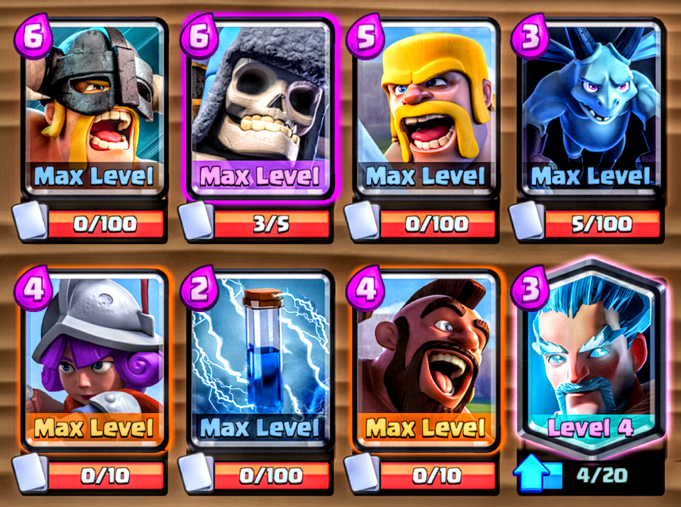

# Boom Boom Zoom!
Explosions! 💣 Speed! ⚡ Versatility! 💥

Boom Boom Zoom is a fun deck I've been using in the 4600-5000 trophy range. It consists of three win conditions: 1) Giant Skeleton, 2) Hog Rider, and 3) Elite Barbarians, and flexible defense/counter pushes using: 1) Barbarians, 2) Minions, 3) Musketeer, 4) Zap, and 5) Ice Wizard.

  

## Offense

### Giant Skelly/Hog Rider Bridge Spam

As an opening move, or if your opponent is low on elixir, wait until you have full (9.5 elixir) and place Giant Skeleton right at the bridge. Then, offset your Hog Rider one tile to the left or right, behind the Giant Skeleton. The Hog Rider will push your Giant Skeleton to the opponent's tower if left unchallenged. If/when your Giant Skeleton and Hog Rider both make it to the tower, you're almost guaranteed to get a crown as their tower blows up in a massive explosion! Your opponent will be like 🤯.

#### Be ready to zap
Your opponent might put out Skeleton Army as a defense; keep your zap ready to obliterate those little distractions! Another possibility is they respond with Inferno Tower or Inferno Dragon. In this case, wait 2-3 seconds and then Zap the lazer machine/animal. This prevents your Giant Skeleton or Hog from taking too much damage and they'll both reach the tower.

#### Mini-tanks that stop Giant Skeleton
Sometimes, as defense, your opponent might put out a Knight or Valkyrie to stop the Giant Skeleton from reaching their tower. In this case, send out Minions behind your push and they'll quickly take out the mini-tank. If they don't put out another card to stop it, your Giant Skeleton will reach their tower in time for a **_huge explosion_** in most cases.

#### Note
It's awesome when the Giant Skeleton bomb blows up a tower. Most of the time, however, your Giant Skeleton won't make it there. **But**, it often serves as a BIG distraction as your opponent will be desperate for it not to reach their tower. In that case, it's common for their troops to be preoccupied with the Giant Skelly, while your Hog Rider hammers away at the tower. 😁 Bonus: When more focus is put on defending the Hog, this strategy is offense/defense in one package as the bomb will likely kill EVERYTHING, leaving your opponent with nothing for a counterpush.

### Elite Barbarians/Hog

Sometimes you may want to save Giant Skeleton for defense (depending on your opponent's deck). In this case, you can use a similar technique. Place Elite Barbarians at the bridge, offsetting one tile to the left if pushing on the right side or one tile to the right if pushing the left. Then place Hog Rider right behind them at the bridge. Keep Zap/Minions ready for the same situations as above.

### Lone Hog Rider

If elixir management is handled well by making positive elixir trade-esque defenses (see [Defense](#defense)), you may find yourself in situations where your opponent has **no** elixir. An effective offense, in these types of battles is to simply throw out a lone Hog Rider while their elixir is still recovering.
  - Sometimes it's best to send him yelling "Hog Riderrr" _as soon as_ you recover four elixir. If your opponent's still drained, your Hog Rider will take out most/all of the tower's health.
  - If you know your opponent has Skeleton Army coming up, wait until you save up 5 elixir and send out the Hog Rider--hover Zap and aim carefully to take out every last Skeleton in one shot (so satisfying).
  - Other Zap tips:
      - If Cannon is an issue, hover Zap and aim to hit the Cannon + their tower. When you Zap a cannon, Hog Rider takes one less hit to kill it. If Cannon is their only response (out of elixir) your Hog Rider will do some serious damage to their tower.
      - Inferno Tower: Similar to the Giant Skeleton/Hog Rider push, wait to Zap the Inferno Tower until 2-3 seconds have passed. Again, if Inferno Tower was their only response due to your superior elixir management skills, your Hog Rider will survive and after destroying the lazer machine, will get a few hits on their tower.

## Counter Pushes

Many times you'll defend opponents' counter pushes with Musketeer, Ice Wizard, or Minions. As your follow-up counter push, add Hog Rider into the mix.

### Musketeer Counter Push
Wait until your Musketeer is almost at the bridge. Then, place Hog Rider in front of her so that he rides his way to the tower and tanks for the Musketeer. Keep Zap ready for Skeleton Army/Minions/Goblins

### Minions Counter Push
Similar to a Musketeer counter push, wait until the Minions you just used to defend are half-way to the bridge. Then, place your Hog Rider in front to ride his way to the tower with air support from your little blue flying monsters.

### Ice Wizard Counter Push
After defending with Ice Wizard, you can either place Hog Rider in front or behind. Either way has its benefits.
- Behind: If your Ice Wizard crosses the bridge first, he'll likely lock onto the tower, slowing down the tower princess/king cannon and tank for the Hog Rider.
- Front: If your Hog Rider crosses the bridge first, he'll take shots from the tower; but, your Ice Wizard will likely slow down your opponent's response (slow down barbarians so Hog Rider gets an extra hit in, shoot ice at Minions so they're immediately Zappable, take out Skeletons/Skeleton Army, slow down Mini P.E.K.K.A. so Hog Rider survives longer, etc.).

### Hog Rider Not In Rotation
It's riskier due to a higher elixir cost, but if Hog Rider is not in rotation you can use the same strategies with Elite Barbarians, e.g., wait until Musketeer/Ice Wizard/Minions are almost at the bridge and then place your Elite Barbarians.

## Defense

### Tanks: Giant/Giant Skeleton/Lavahound/Golem

One of the deck's main defensive capabilities is against tanks. Here are some likely situations:

1) **Giant** 
    - Place Barbarians in front of the Giant (don't surround) so they'll take him out without having to chase it
    - If the Giant is supported by a Witch/Night Witch, add in Ice Wizard so he'll slow down the Giant while protecting
your Barbarians from Skeleton/Bat spawnees.

2) **Giant Skeleton** 
    - **Important** - Wait until your opponent's Giant Skeleton crosses the bridge, then place your Barbarians _behind_ it. That way they won't get exploded when the Giant Skeleton dies!

3) **Royal Giant**
This deck can deal with Royal Giants very effectively. Here are a couple cases:
    - Your general response should be to slow down the Royal Giant with Ice Wizard. Then, place Barbarians in front to put him down and minimize tower damage taken. If they don't have a good response to this, your tower can survive all the way through overtime without being destroyed.
    - Opponent uses Fireball + Zap/Log to wipe out your Barbarians, but your Ice Wizard is still slowing it down: Your response should depend on you and your opponent's elixir management.
        - If you're low on elixir, you can put down Minions to quickly take it down (risky if they're carrying Wizard/Witch/Arrows).
        - A safer way is to support your Ice Wizard with Musketeer--you'll take slightly more damage but still take out the Royal Giant relatively quickly and be ready for a counter attack.
        - Yet another option is to replace your dead Barbarians with Elite Barbarians, who will take it down with ease. Be ready to Zap or add support Minions so your Elite Barbs can make an effective counter attack.

4) **Lavahound**
Lavahound defense with this deck can get complex depending on how your opponent supports it. Here are a few situations:
    - In general, you want to start out with putting down Ice Wizard and/or Musketeer at the back (self-explanatory air defense).
    - Minion Horde support: You'll want to Zap the Minion Horde so that your Ice Wizard's splash damage will take them out as they come close to the Lavahound
    - Balloon support: Usually they'll place the Balloon behind the Lavahound. In this case, you'll want to place your Minions at the bridge to attack the Balloon _as soon as possible_. They likely have Arrows to counter, but also don't normally have the elixir to take out your Minions right away.
    - Your Ice Wizard or Musketeer survived and their Lavahound is about to pop: _Right before_ those little buggers come popping out of the flying Lavahound corpse, put down Minions at your tower. Waiting until just before the Lavahound pops is a good strategy because if you put them down earlier they'll most likely be killed by Arrows. However, now your Minions are quickly taking out the Lava Pups. Even if they then throw out Arrows it'll be too late because Arrows take time to cross the arena.
    - Zap in a pinch: Say your Minions have already been taken out by Arrows (e.g., while defending a Balloon) your only surviving troop is your Ice Wizard/Musketeer, and you're low on elixir. It takes some practice, but a good strategy is to hover your Zap centered on _the shadow_ of the Lavahound. Let go and time it so your Zap lands immediately after the Lavahound pops. Assuming tournament standard (this works even better in ladder--could one-hit the Lava Pups from a non-maxed Lavahound), your Zap will hit all the Lava Pups, leaving them within an inch of death. Your surviving Ice Wizard or Musketeer and tower(s) will then quickly clean them up.
    - Heavier support such as Mega Minion/Flying Machine or ground troops: Sometimes your opponent will focus on taking out your air defense. With Mega Minion, it's sometimes best to just distract them with either Barbarians or Giant Skeleton. That way, your Ice Wizard/Musketeer won't take fire. Flying Machine can be taken out by your Minions relatively quickly. Ground troop support should be taken out as usual with Barbarians/Elite Barbarians/Zap in order to keep your air defense alive.
    - Avoid putting down _both_ Ice Wizard _and_ Musketeer if your opponent's running Lightning. It's best to not give them an easy positive elixir trade. Just use one or the other and support with Minions or Zap.
    - There are other situations: [Feel free to ask!](https://github.com/Dilly36/Boom-Boom-Zoom/issues)

4) **Golem** 
    - The main threat with Golem pushes is what they put _behind_ the Golem, not the Golem itself. To counter the trailing support, wait until the Golem is almost at the bridge. Then, offset your Giant Skeleton to one side of the Golem so that he won't be pushed back by it and will remain behind the Golem. This will do two things: 1) When your Giant Skeleton eventually dies, it'll blow up ALL the support troops if placed correctly. 2) In the meantime, your Giant Skeleton will tank for your response to the Golem. You can take it out with Barbarians, Ice Wizard/Musketeer, or even just Minions. (However, make sure to place Minions behind the Golem so that when it blows up they won't pop from its death damage.)

5) **P.E.K.K.A.**
With advanced players, you'll mostly see P.E.K.K.A. used to defend against your Giant Skeleton/Hog Rider or Lone Hog Rider pushes. They'll then set up a counterpush lead by the P.E.K.K.A..
    - Start by placing your Ice Wizard one tile to the left/right of the middle about 2-3 tiles down from the river. This will slow down and distract the P.E.K.K.A. away from your tower.
    - The rest of your response will depend on your opponent's deck and how they support the P.E.K.K.A.
        - The most elixir-conversavative method of destroying the P.E.K.K.A. will be to send out some Minions to spit on his head. Combined with the Ice Wizard's slowing/distracting, Minions will completely kill the P.E.K.K.A. without any hits to your tower or your Ice Wizard.
        - Wizard/Witch/Arrows (air defense), etc. support: When it's too risky to send out your Minions because they'll die to air defense cards, the next best option is to support your Ice Wizard with a Musketeer placed on the _other side_ of your tower (Ice Wizard middle & Musketeer far left/right of your tower--see [Stragglers](#stragglers)). Your Ice Wizard still servers his purpose of slowing/distraction and Musketeer will get in the DPS to take out the P.E.K.K.A. and then stand ready to kill their supporting Wizard/Witch, etc. afterwards.
        - Alternatively, you can wait until the P.E.K.K.A. crosses the bridge and then place Barbarians behind her. Don't be afraid if she's supported by a Witch or Wizard, which would normally obliterate your Barbarians. What you want to do in that case is wait until the supporting Witch/Wizard crosses the bridge and then **surround it**.
            - When it's a Wizard, he'll attack one or two of your Barbarians once, but all four of them will strike their swords on him for an instant kill and then focus on pummeling the P.E.K.K.A.. 
            - For a Witch, the problem is not so much the Witch herself, but the Skeletons she spawns. They can be quite distracting for the Barbarians, who you'd really like to be focused on whacking the P.E.K.K.A. to death. Luckily, with this strategy you've already put down your Ice Wizard. His splash damage should take out the spawned Skeletons around the P.E.K.K.A, freeing up the Barbarians to beat down the Witch and P.E.K.K.A.

6) **Mega Knight**

- Barbarians: The best defense available against a Mega Knight is to wait until he's crossed the bridge and then surround him with your Barbarians. He'll attack one or two of them, but quickly be overtaken by your drooling Barbarians.
        - Ready Zap to take out supporting Bats (likely with Mega Knight users).
- If Barbarians aren't an option (out of rotation), use Elite Barbarians instead. Use the same strategy as Barbarians, but just make sure you place your Elites right on top of the Mega Knight. That way, when they spawn they'll be split on both sides of the Mega Knight and he'll only be able to pound on one of them.

- If (Elite) Barbarians aren't available, you have to be a little desperate and try anything to avoid the Mega Knight getting to your tower.
    - One option is Giant Skeleton. It's costly on your elixir, but it'll stop the Mega Knight in his tracks so you can take it out with Minions or Musketeer. It will also tank their supporting troops to protect your Minions/Musketeer if placed well. Bonus: if there happens to be a lot of support troops, the Giant Skeleton bomb will obliterate them, leaving you free for a counterpush with your remaining troops.
    - An advanced tactic when you're low-ish on elixir might be to 1) wait until Mega Knight is about to cross the river, 2) send out your hog so it jumps over the river. This should distract the Mega Knight so he turns around and starts walking back to your opponent's tower. If your hog gets stopped/slowed, the Mega Knight might even jump further back into your opponent's side and end up behind whatever support troop(s) they meant for him to be in front of. That way, you can kill the support troops first and then take out the Mega Knight.

### Elite Barbarians/Hog Rider

3) **Elite Barbarians** 
    - If Elite Barbarians are furiously sprinting towards your tower, ready the Barbarians! However, don't place your Barbarians between the charging Elites and your tower. This is what your opponents are expecting and may throw out Fireball/Log predictively.
    - Instead, place your Barbarians in the center, about 3-4 tiles down from the river. That way, the Elite Barbarians will get distracted, run to your Barbarians and get taken out.

4) **Hog Rider** 
    - One of your main defenses against Hog Rider is Barbarians. They can completely counter a lone Hog Rider if placed well. For example, if their Hog Rider is heading straight down the middle place your Barbarians in the middle too. If their Hog Rider is jumping over the river, it'll head towards your tower one tile to the left or right of the path. Offset your Barbarians one tile in response. With practice, you can completely shut down a hog no matter how it's placed with this strategy.
    - In a pinch, Minions will prevent most of their Hog Rider's damage.
    - Ice Wizard or Musketeer can do OK too.

### Stragglers
Knight/Archers/Goblin Gang/Bomber/Minion Horde/Minions/Mega Minion/Flying Machine/Mini P.E.K.K.A./Zappies/Valkyrie/Wizard/Ice Wizard/Musketeer/Skeleton Army/Guards/Baby Dragon/Executioner/Cannon Cart/Witch/Bowler/Bandit/Princess/Night Witch/Inferno Dragon/Lumberjack/Elector Wizard Stragglers

Your opponent may have defended with any of these cards, but didn't have enough elixir to add anything else as a counter push. These are what I like to call stragglers.

  - **Ice Wizard**
      - In most cases, you want to try to defend these with as little elixir as possible. Ice Wizard is the troop for that job! Play around with his placement and you'll find that he can shut down ALL of these cards (if they're alone) completely.
  
  - **Musketeer**
      - Similary, Musketeer will shut these down completely (but costs one more elixir). If there's a multiple straggler or small counterpush situation, however, combining the defensive power of Ice Wizard + Musketeer can effectively counter many combinations and set you up for a nice counterpush. A best practice is to place your Ice Wizard on one side of your tower and your Musketeer on the other. This is beneficial in many situations:
        - Fireball: Since your Ice Wizard and Musketeer are separate, Fireball can only hit one of them due to its range.
        - Splash damage (from Wizard, etc.): Again, since they're separated, splash damage can only hit one of them.
        - Ground troops: Say ground troops run to your Ice Wizard first and kill it. It's best not to have your Musketeer right next to him to get roughed up next. Placing her away from your Ice Wizard will cause the ground troop(s) to have to run further, giving your Musketeer and tower more time to take them out.

### Spawners
In general, you can use Ice Wizard or Musketeer to temporarily defend spawner buildings. For example, if it's a Furnace wait until the first pair of Fire Spirits are crossing the bridge. Then place Ice Wizard or Musketeer right next to your tower. It will kill them before your tower takes any damage.

However, this only works temporarily and won't take out the Furnace unless your opponent doesn't defend at all. Another strategy is to wait until right after the first pair of Fire Spirits crosses the river. Then, send your Hog Rider jumping over the river to destroy the Furnace. If timed well, your tower will take out one Fire Spirit with the other hitting your Hog.

If you're up against a spawner deck (full of spawner buildings, e.g., Barbarian Hut, Goblin Hut, etc.) you should spend most of your time defending with as little elixir as possible (mostly Ice Wizard and Musketeer). Then, when you can, send out Hog Rider for sneak attacks. If the spawned troops build up way too much (usually in overtime), an easy way to reset it is to blow it all up with Giant Skeleton, which leads me to:

### Too many troops!? Blow it all up! 💣
Sometimes, your best response is to use your ultimate defense: Giant Skeleton's death damage/bomb explosion. It can one-hit kill most troops in the game.

For example, say your opponent got desperate and sent out some combination of Wizard/Musketeer/Witch/Night Witch/Mini P.E.K.K.A/Knight/Mega Minion/Zappies/Sparky/Valkyrie/Hunter/Executioner/Bowler/Three Musketeers, etc. As long as they spent more than 6 elixir (easily could happen with 2 or more troops) then it's a positive elixir trade to just place your Giant Skeleton at the bridge and blow it all up! It feels great to put an explosive end to their big push too. 🤣

I hope you enjoy this deck as much as I have! It's super fun to blow up big pushes/towers while still having the versatility to adapt to your opponents' decks. It has a high rate of three crown wins if played aggressively. I used this deck to get to ~4600 trophies as a level 10 when Elite Barbarians were just released, and more recently, ~5000 trophies as a level 11. It takes some practice to get used to, but manage your elixir wisely with tight defenses and in no time you won't be able to restrain yourself from audibly exclaiming "Muahaha!" as your opponent's king tower explodes in a firey mushroom cloud of shattered Giant Skeleton bones. 😈 🤯 😆

Feel free to ask about any other situations you come across that weren't covered here: [Questions?](https://github.com/Dilly36/Boom-Boom-Zoom/issues)
